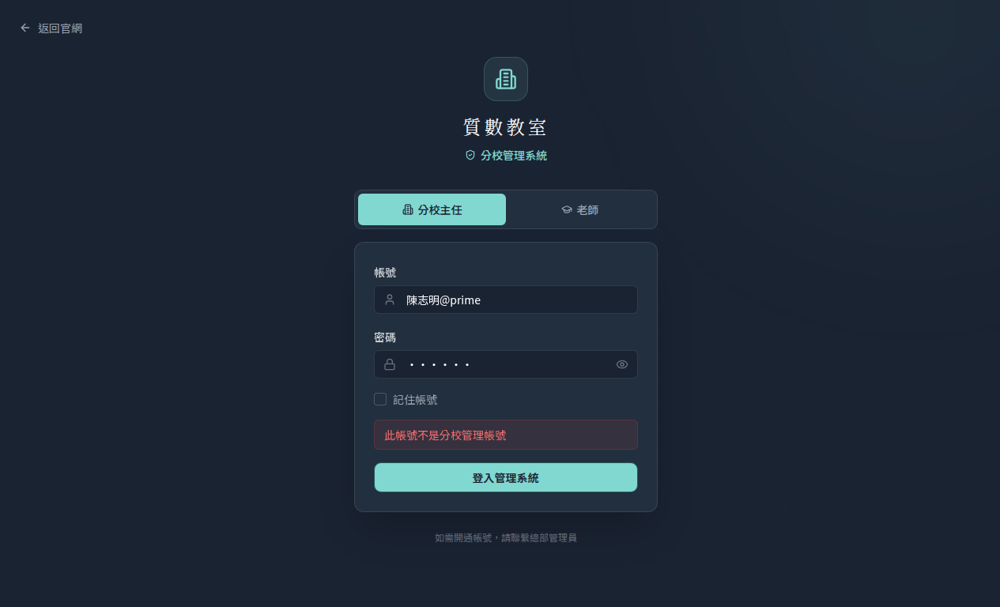
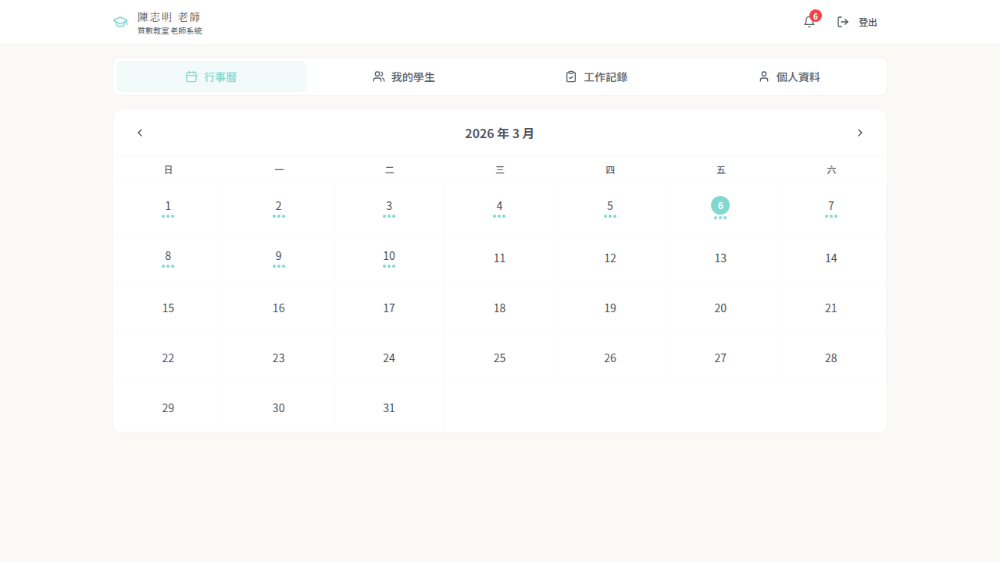
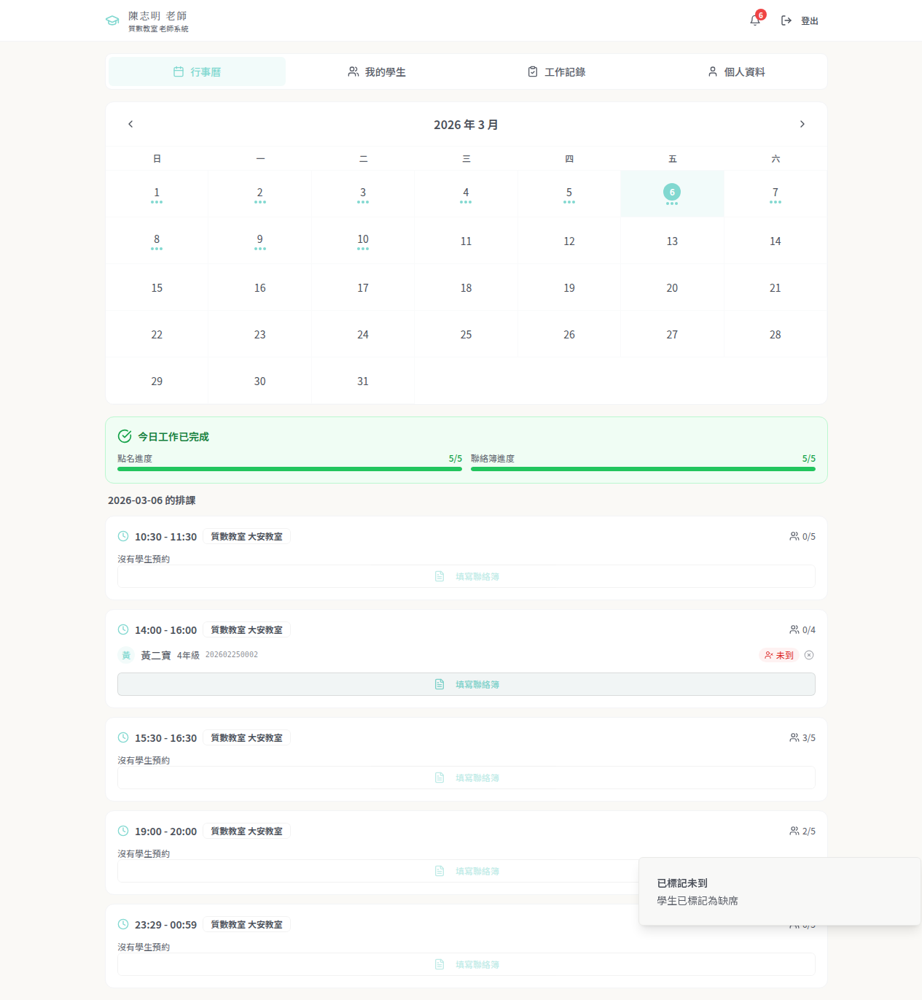
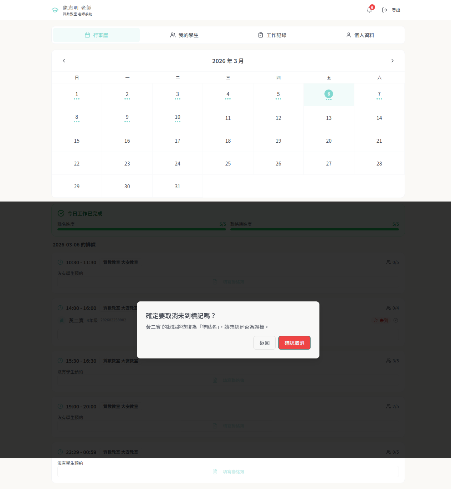
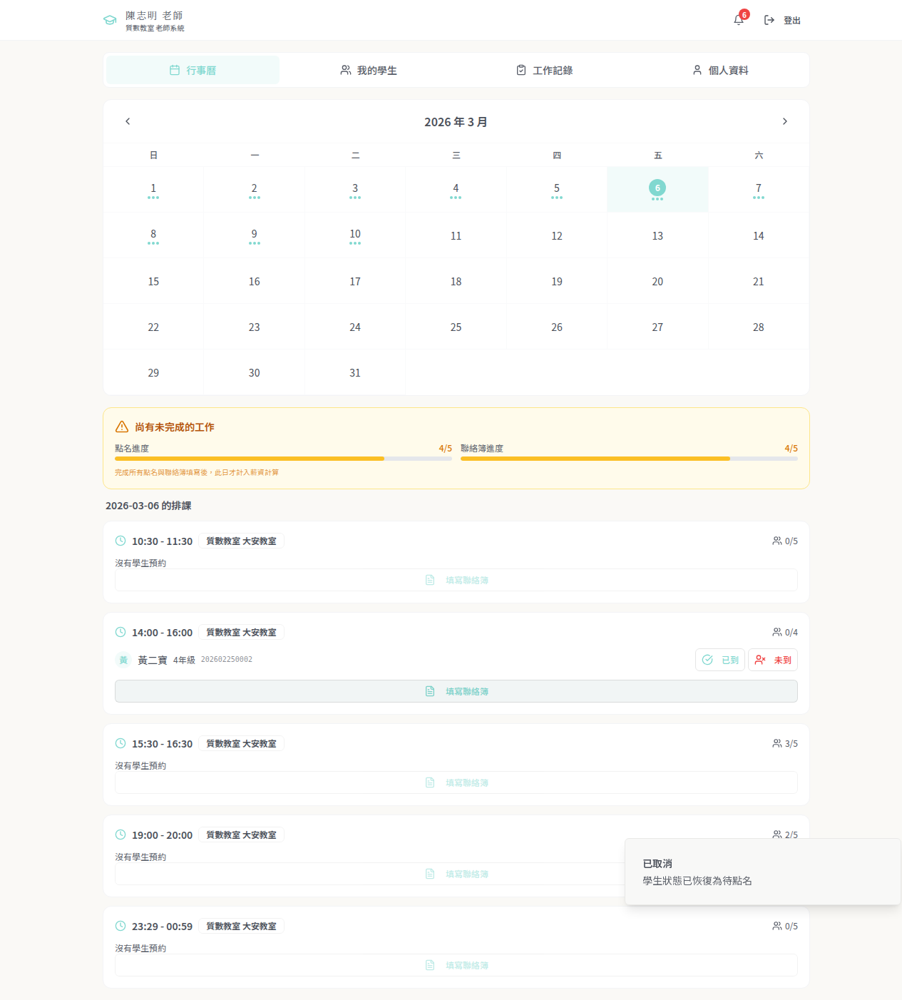
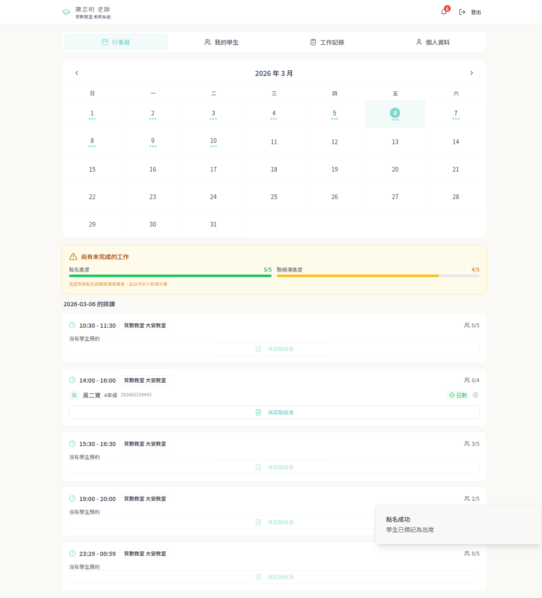
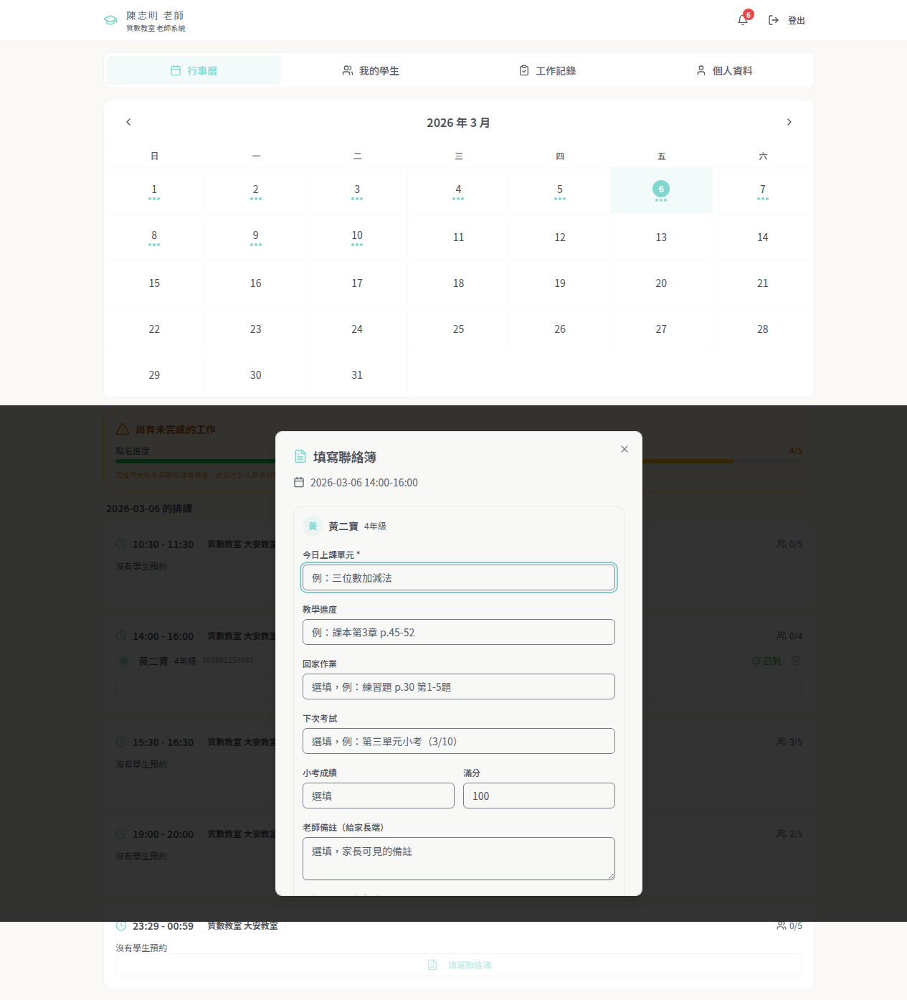
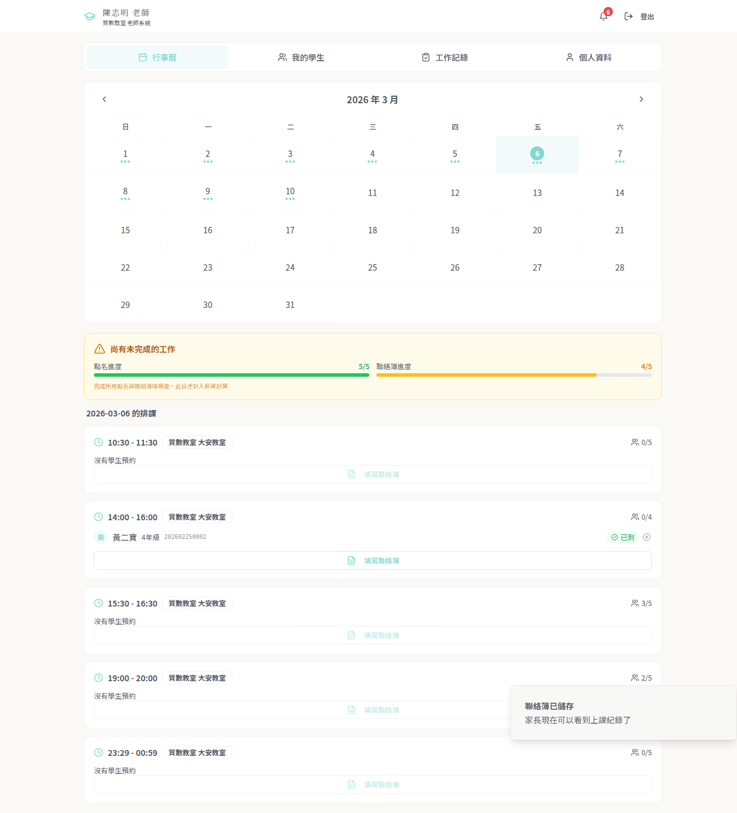

# 老師點名流程測試報告

**測試日期**: 2026-03-06  
**測試帳號**: 陳志明@prime  
**測試結果**: 全部通過

---

## 測試流程

### Step 1: 登入老師系統

老師透過分校登入頁面，切換到「老師」分頁，輸入帳號密碼登入。

---

### Step 2: 查看今日排課與學生列表

登入後進入行事曆頁面，可看到當日所有排課。14:00-16:00 時段有學生「黃二寶」，顯示「已到」和「未到」兩個點名按鈕。

---

### Step 3: 標記學生「未到」

點擊「未到」按鈕後，學生狀態變為紅色「未到」badge。右下角顯示「已標記未到 - 學生已標記為缺席」提示。

此時每日工作紀錄顯示「今日工作已完成」（因為未到的學生不需要填寫聯絡簿）。

---

### Step 4: 取消未到標記（確認對話框）

點擊「未到」badge 旁邊的 X 按鈕，彈出確認對話框：「確定要取消未到標記嗎？黃二寶 的狀態將恢復為『待點名』，請確認是否為誤標。」

---

### Step 5: 恢復為待點名狀態

確認取消後，學生恢復為「待點名」狀態，重新顯示「已到」和「未到」按鈕。右下角提示「已取消 - 學生狀態已恢復為待點名」。

此時工作紀錄更新為「尚有未完成的工作」，點名進度回到 4/5。

---

### Step 6: 點名成功（已到）

點擊「已到」按鈕，學生狀態變為綠色「已到」badge，右下角顯示「點名成功 - 學生已標記為出席」。

點名進度恢復為 5/5，但聯絡簿進度仍為 4/5（尚未填寫此學生的聯絡簿）。

---

### Step 7: 填寫聯絡簿

點擊「填寫聯絡簿」按鈕，開啟聯絡簿表單。表單包含：
- 今日上課單元（必填）
- 教學進度
- 回家作業
- 下次考試
- 小考成績 / 滿分
- 老師備註（給家長端）

---

### Step 8: 聯絡簿儲存成功

填寫完畢後點擊儲存，右下角顯示「聯絡簿已儲存 - 家長現在可以看到上課紀錄了」。

聯絡簿進度更新，此時段的點名和聯絡簿均已完成。

---

## 測試結論

| 功能 | 狀態 |
|------|------|
| 老師登入 | 通過 |
| 查看排課與學生 | 通過 |
| 標記學生未到 | 通過 |
| 取消未到標記 | 通過 |
| 標記學生已到 | 通過 |
| 填寫聯絡簿 | 通過 |
| 聯絡簿儲存 | 通過 |
| 每日工作紀錄自動更新 | 通過 |
