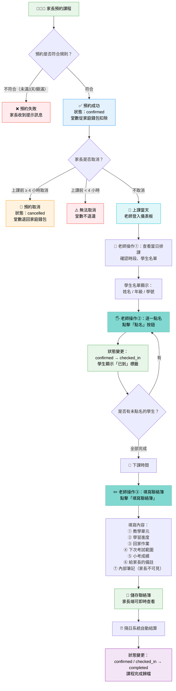

# 老師端操作流程圖

> 從家長預約 → 學生上課 → 學生下課，老師在每個階段需要執行的操作

---

## 流程圖

---

## 各階段詳細說明

### 階段一：家長預約

| 項目 | 說明 |
|------|------|
| 觸發者 | 家長 |
| 操作方式 | 家長在平台搜尋教室 → 選擇老師 → 選擇可用時段 → 為孩子預約 |
| 預約規則 | 必須提前至少 **3 天**預約；每個時段最多 **5 位**學生 |
| 預約結果 | 預約成功後狀態為 `confirmed`，堂數從家庭錢包扣除 |
| 老師需做的事 | **無**（系統自動處理，老師在儀表板可看到新預約） |

---

### 階段二：上課前 — 查看排課

| 項目 | 說明 |
|------|------|
| 觸發者 | 老師 |
| 操作位置 | 老師儀表板 → 行事曆分頁 → 點擊日期 |
| 可查看資訊 | 每個時段卡片顯示：上課時間、教室名稱、已預約人數/上限 |
| 學生名單 | 展開時段可看到每位學生的：姓名、年級、學號 |
| 老師需做的事 | **查看當日排課**，確認學生名單，做好備課準備 |

---

### 階段三：上課中 — 點名

| 項目 | 說明 |
|------|------|
| 觸發者 | 老師 |
| 操作方式 | 在時段學生列表中，對每位到場學生點擊「點名」按鈕 |
| 狀態變更 | `confirmed` → `checked_in` |
| UI 反饋 | 點名後按鈕變為綠色勾勾，學生旁顯示「已到」標籤 |
| 家長端同步 | 家長儀表板即時顯示「上課中」橘色標籤 |
| 老師需做的事 | **逐一為到場學生點名**（未到場的學生不點名即可） |
| 注意事項 | 點名後學生的預約無法被家長取消 |

---

### 階段四：下課後 — 填寫聯絡簿

| 項目 | 說明 |
|------|------|
| 觸發者 | 老師 |
| 操作方式 | 在時段卡片中點擊「填寫聯絡簿」按鈕，開啟填寫對話框 |
| 填寫欄位 | 見下方表格 |
| 老師需做的事 | **為該時段的每位學生填寫聯絡簿** |

#### 聯絡簿填寫欄位

| 欄位 | 說明 | 家長可見 |
|------|------|----------|
| 教學單元 | 今天教了什麼內容 | ✅ |
| 學習進度 | 學生的理解程度與學習狀況 | ✅ |
| 回家作業 | 指派的練習或作業 | ✅ |
| 下次考試 | 下次小考的範圍或時間 | ✅ |
| 小考成績 | 本次小考的分數（如有） | ✅ |
| 給家長備註 | 想讓家長知道的事情 | ✅ |
| 內部筆記 | 老師自己的教學記錄 | ❌ |

---

### 階段五：系統自動結算

| 項目 | 說明 |
|------|------|
| 觸發者 | 系統自動執行 |
| 執行時機 | 當日期超過上課日時自動觸發 |
| 狀態變更 | `confirmed` 和 `checked_in` → `completed` |
| 老師需做的事 | **無**（系統自動處理） |

---

### 分支流程：家長取消預約

| 項目 | 說明 |
|------|------|
| 取消條件 | 上課開始前 **≥ 4 小時**：可取消，堂數退回 |
| 不可取消 | 上課開始前 **< 4 小時**：不可取消，堂數不退 |
| 不可取消 | 狀態為 `checked_in`：不可取消（已點名） |
| 老師需做的事 | **無**（取消由家長操作，系統自動處理） |

---

## 預約狀態對照表

| 狀態 | 英文代碼 | 說明 | 老師端顯示 | 家長端顯示 |
|------|----------|------|------------|------------|
| 已確認 | `confirmed` | 家長已預約成功 | 顯示「點名」按鈕 | 已確認 |
| 已到 | `checked_in` | 老師已點名確認出席 | 顯示「已到」標籤 | 上課中 |
| 已完成 | `completed` | 課程結束（系統自動） | 歷史記錄 | 已完成 |
| 已取消 | `cancelled` | 家長取消預約 | 不顯示 | 已取消 |

---

## 老師端操作摘要

老師在整個流程中只需要執行 **三個動作**：

1. 📅 **查看排課** — 登入儀表板，確認當天的時段和學生名單
2. 🖐️ **點名** — 上課時為到場學生逐一點名
3. ✏️ **填寫聯絡簿** — 下課後記錄每位學生的學習狀況
